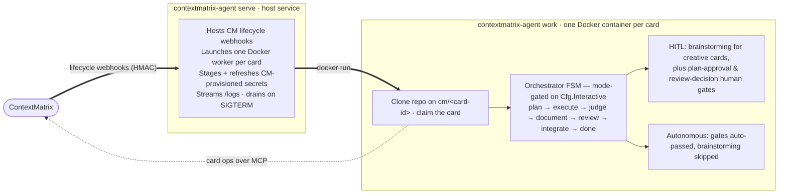

# ContextMatrix Agent

> [!WARNING]
>
> This project is under heavy development. Breaking changes should be expected
> at the current stage.

A custom Go agent harness with a configurable LLM endpoint that runs as a ContextMatrix
**task backend**: ContextMatrix dispatches a card, this service launches a Docker
worker container, and the worker drives a hand-built model-in-the-loop harness —
claiming the card, working the code in a target repository, and reporting
progress back to the board over MCP.

It is for operators who run [ContextMatrix](https://github.com/mhersson/contextmatrix)
and want model-flexible, cost-optimized autonomous execution: any
OpenAI-compatible model per role, picked by external quality priors per role
rather than a hard-coded vendor.

## How it fits ContextMatrix

ContextMatrix splits its backend contract into a `TaskBackend` (card lifecycle)
and a `ChatBackend` (interactive chat), resolved independently. This service
implements `TaskBackend`.

Two channels connect the agent to ContextMatrix:

- **Lifecycle webhooks (CM → agent).** ContextMatrix calls `/trigger`, `/kill`,
  `/stop-all`, `/message`, `/promote`, and `/end-session` over the
  [`contextmatrix-protocol`](https://github.com/mhersson/contextmatrix-protocol)
  HMAC contract. The agent reports status back to `/api/agent/*`.
- **Card operations (worker → CM, over MCP).** Inside each container the worker
  claims the card, heartbeats, reports usage, sets the orchestrator phase,
  transitions state, and completes the task using ContextMatrix MCP tools.

## Architecture

One binary, two runtime roles:



- **`serve`** is the task backend. It owns container lifecycle, resource limits,
  idle/timeout watchdogs, secret refresh, and graceful drain.
- **`work`** is the in-container agent. It runs the inner loop, fans out
  read-only review subagents, commits and pushes incrementally, and finalizes
  with an autosquash + force-push.

Two per-card execution strategies layer on top of the FSM, both switched on by
card fields set in ContextMatrix:

- **Best-of-N** (`best_of_n` ≥ 2) — after planning, the worker races N
  candidate implementations in parallel git worktrees, each with its own
  budget ledger and an auto-selected coder model (distinct models where the
  eligible pool allows, wrapping around when it is smaller than N); a judge
  phase picks the winner, which is adopted onto the main clone and pushed.
  Losing candidates never push and are removed.
- **Mob session** (`mob_participants` ≥ 2) — the plan and review phases
  convene a moderated multi-seat discussion over the A2A protocol (loopback
  JSON-RPC seats plus optional registered guest agents); when the card's
  execute-checkpoints flag is set, the execute phase additionally convenes a
  per-subtask checkpoint discussion ending in a proceed/revise verdict,
  tier-gated via the checkpoint min-tier. The decision model synthesizes each
  group's answer into the phase's normal output, and the live transcript
  streams to the card's chat tab on the board. Discussions degrade to the solo
  path rather than failing the run, and mob session composes freely with a
  Best-of-N execute race.

The inner loop lives in the standalone `github.com/mhersson/contextmatrix-harness`
module (`events`, `llm`, `tools`, `harness`, `redact`) — FSM-free and
dependency-free, shared with the
[contextmatrix-chat](https://github.com/mhersson/contextmatrix-chat) backend.
This service wraps it with the task FSM (`orchestrator`/`worker`) to execute
board cards.

## Requirements

- **Go 1.26+** to build.
- **Docker** on the host running `serve` (the worker runtime).
- An **LLM endpoint API key** with access to the models you route to.
- A reachable **ContextMatrix** instance (API + MCP) and its MCP API key.
- **GitHub auth configured in ContextMatrix** (a GitHub App or a fine-grained
  PAT) — ContextMatrix mints per-run tokens for cloning and pushing target
  repositories; the agent itself carries no GitHub credentials.

## Quick start: the harness, standalone

Build the binary and drive the loop against a local workspace, no ContextMatrix
required. This is the fastest way to watch the inner loop work and to size a
weak model's tool-call reliability.

```bash
make build
export LLM_API_KEY=<your-api-key>
# For non-OpenRouter endpoints, also set:
#   export LLM_TYPE=openai
#   export LLM_BASE_URL=https://your-llm-endpoint.example/v1

# Run the harness on a workspace with a free-form task.
./contextmatrix-agent run \
  --model openai/gpt-oss-120b \
  --workspace /path/to/a/git/checkout \
  --task "Fix the failing TestAdd in calc_test.go, then run the tests." \
  --verify "go test ./..." \
  --transcript run.jsonl
```

## Running as a ContextMatrix backend

1. **Build the worker image.** The worker image bundles the agent binary plus
   the CLIs the harness expects; toolchain versions are pinned and
   SHA256-verified.

   ```bash
   make docker-worker          # tags contextmatrix-agent-worker:dev (full)
   ```

   The image ships in four variants, selectable per project via the board's
   `remote_execution.worker_image`:

   | Variant   | Toolchains                                                             |
   | --------- | ---------------------------------------------------------------------- |
   | `full`    | Go, Node, Python, Rust toolchains — the default (`:dev` / `:latest`).  |
   | `go-node` | Go (+ golangci-lint, gofumpt) + Node.                                  |
   | `python`  | Node + uv/uvx + CPython + ty + ruff.                                   |
   | `rust`    | rustup/cargo (+ clippy, rustfmt). No Node.                             |

   Every variant also carries the baseline CLIs (`git`, `gh`, `rg`, `fd`). Build
   the slim variants with `make docker-worker-variants` (tags
   `contextmatrix-agent-worker:go-node`, `:python`, `:rust`).

   **Any other ecosystem ⇒ set the project's `remote_execution.worker_image` to
   a custom image** — see `docs/custom-images.md`.

   For deployment, publish a digest-pinned image (for example
   `ghcr.io/mhersson/contextmatrix-agent@sha256:...`) and reference it from
   `base_image`.

2. **Write the service config.** Copy the template and edit it. Every scalar
   field also has a `CMX_*` environment override (e.g. `CMX_BASE_IMAGE`);
   list/map fields are YAML-only or use the nested `CMX_…__KEY` form — see each
   field's note in the template.

   ```bash
   mkdir -p ~/.config/contextmatrix-agent
   cp serve.yaml.example ~/.config/contextmatrix-agent/serve.yaml
   # set: api_key, mcp_api_key, base_image, container_contextmatrix_url
   ```

   ContextMatrix provisions the git token and the LLM endpoint per run over
   the trigger payload — the agent carries no local credential config, and a
   trigger without CM-provisioned credentials is rejected.

   `container_contextmatrix_url` is required in practice — workers resolve their
   MCP URL from it; without it they point at their own localhost and fail to
   connect. For Docker bridge networking it is typically the bridge gateway
   (`http://172.17.0.1:8080`).

3. **Run the service.**

   ```bash
   ./contextmatrix-agent serve            # listens on :9092
   ```

   `serve` reads `--config` (default `~/.config/contextmatrix-agent/serve.yaml`)
   and validates it on startup. To inspect effective harness config with secrets
   redacted, use `run --print-config`.

4. **Point ContextMatrix at it.** Enable the `backends.agent` entry in
   ContextMatrix's config (URL + shared `api_key` + `enabled: true`); the
   callback paths (`/api/agent/*`) are fixed by the protocol, not configured.
   A backend switch needs a ContextMatrix restart: drain running jobs → switch
   → restart.

### Service management

For an unattended deployment, run the agent as a systemd **user** service
instead of the foreground `serve` command:

```bash
make build                    # build the contextmatrix-agent binary
./svc.sh install              # write + enable ~/.config/systemd/user/contextmatrix-agent.service
./svc.sh start                # start it (also: stop / status / print / verify / uninstall)
```

The generated unit is sandboxed (read-only home, restricted syscalls, resource
caps) and runs `serve --config ${XDG_CONFIG_HOME:-~/.config}/contextmatrix-agent/serve.yaml`.

`redeploy.sh` updates a running install in place — rebuild the binary and all
worker images (full + variants), pin the new full-image digest into
`serve.yaml`, and restart the service:

```bash
./redeploy.sh
```

> **Writable runtime dir.** The agent writes secrets under `secrets_dir`
> (default `/var/run/cm-agent/secrets`). `/var/run` is root-owned and not created
> for a user service — either pre-create `/var/run/cm-agent` and `chown` it to
> your user, or set `secrets_dir` to a path under your home (e.g.
> `~/.cm-agent/secrets`); the unit whitelists both.

## Commands

| Command | Purpose                                                                     |
| ------- | --------------------------------------------------------------------------- |
| `serve` | Run the task backend: host CM lifecycle webhooks, launch worker containers. |
| `work`  | Container entrypoint (hidden): execute one card under CM control.           |
| `run`   | Run the harness on a workspace with a free-form task (standalone).          |

## Model selection

The agent never asks a model to name a model. During planning, a fixed capable
model emits a **complexity tier per subtask** (plus an overall card tier) —
simple / moderate / complex / critical; deterministic code then maps each tier
to the cost-optimal model. A
candidate must be tool-capable, not blacklisted, fit the work's context window,
and carry an external quality **prior** for the role that clears the tier's bar
(the bar rises with the tier, from 0.65 for simple up to 0.90 for critical).
Among those, an eligible operator favorite wins outright; otherwise the selector
picks the most capable candidate whose blended price is within a headroom band of
the cheapest. Selection is **priors-only — there is no measured-capability
gate.** An explicit model pin on the card always overrides.

The selector's inputs are supplied by ContextMatrix, not embedded in the binary.
Each trigger payload carries a `SelectionContext` with the candidate set, their
per-role priors, the operator favorites, and a self-learning blacklist;
`registry.FromSelection` consumes it at run start. The Artificial-Analysis
sourcing, normalization, and tier-bar tuning all live on the ContextMatrix side.

The blacklist is self-learning: when a model proves harness-incapable mid-run
(for example, it cannot reliably call tools), the agent reports it back so it is
excluded and a replacement is re-selected.

## Development

```bash
make build          # go build ./... + the binary
make test           # go test ./...
make lint           # golangci-lint run
make fmt            # gofumpt -w .
make docker-worker           # build the default (full) worker image
make docker-worker-variants  # build the go-node / python / rust variants
```

CI gates every pull request on `go test`, `go test -race`, `golangci-lint`, and
`go build`, plus `govulncheck` and a worker-image scan.

Conventions, package boundaries, the git workflow, and commit discipline for
working **on** this codebase live in [`AGENTS.md`](AGENTS.md).

## Further reading

- [`AGENTS.md`](AGENTS.md) — orientation for contributors and agents.
- [`serve.yaml.example`](serve.yaml.example) — every service config field, documented.
- [ContextMatrix](https://github.com/mhersson/contextmatrix) — the control plane.

## License

MIT — see [`LICENSE`](LICENSE).
